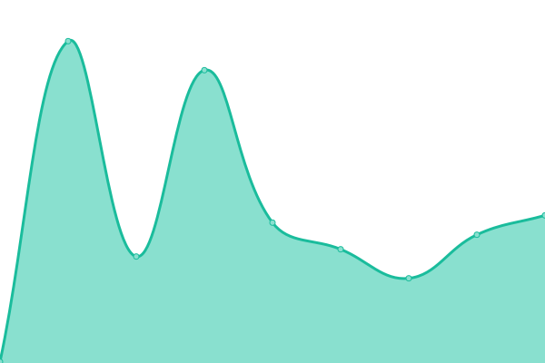

# [📈 Live Status](https://upp.zinglix.xyz): <!--live status--> **🟧 Partial outage**

This repository contains the open-source uptime monitor and status page for [Liu Jun](https://zinglix.xyz), powered by [Upptime](https://github.com/upptime/upptime).

With [Upptime](https://upptime.js.org), you can get your own unlimited and free uptime monitor and status page, powered entirely by a GitHub repository. We use [Issues](https://github.com/ZingLix/blog_upptime/issues) as incident reports, [Actions](https://github.com/ZingLix/blog_upptime/actions) as uptime monitors, and [Pages](https://upp.zinglix.xyz) for the status page.

<!--start: status pages-->
<!-- This summary is generated by Upptime (https://github.com/upptime/upptime) -->
<!-- Do not edit this manually, your changes will be overwritten -->
<!-- prettier-ignore -->
| URL | Status | History | Response Time | Uptime |
| --- | ------ | ------- | ------------- | ------ |
|  [ZingLix Blog](https://zinglix.xyz) | 🟩 Up | [zing-lix-blog.yml](https://github.com/ZingLix/upptime/commits/HEAD/history/zing-lix-blog.yml) | 

 169ms
     
 | 

<a href="https://upp.zinglix.xyz/history/zing-lix-blog">100.00%</a>
    

|  [Alala Console](https://alala.zinglix.xyz) | 🟩 Up | [alala-console.yml](https://github.com/ZingLix/upptime/commits/HEAD/history/alala-console.yml) | 

 629ms
     
 | 

<a href="https://upp.zinglix.xyz/history/alala-console">99.51%</a>
    

|  [Annotation Platform](https://a.zinglix.xyz) | 🟩 Up | [annotation-platform.yml](https://github.com/ZingLix/upptime/commits/HEAD/history/annotation-platform.yml) | 

 955ms
     
 | 

<a href="https://upp.zinglix.xyz/history/annotation-platform">100.00%</a>
    

|  [frp](https://frp.zinglix.xyz) | 🟩 Up | [frp.yml](https://github.com/ZingLix/upptime/commits/HEAD/history/frp.yml) | 

 639ms
     
 | 

<a href="https://upp.zinglix.xyz/history/frp">99.78%</a>
    

|  [ZingLix Go](https://go.zinglix.xyz) | 🟥 Down | [zing-lix-go.yml](https://github.com/ZingLix/upptime/commits/HEAD/history/zing-lix-go.yml) | 

 545ms
     
 | 

<a href="https://upp.zinglix.xyz/history/zing-lix-go">68.40%</a>
    

|  [ZingLix Share](https://x.zinglix.xyz) | 🟩 Up | [zing-lix-share.yml](https://github.com/ZingLix/upptime/commits/HEAD/history/zing-lix-share.yml) | 

 704ms
     
 | 

<a href="https://upp.zinglix.xyz/history/zing-lix-share">99.84%</a>
    

|  [ZingLix Blog Mirror](https://blog.zinglix.xyz) | 🟥 Down | [zing-lix-blog-mirror.yml](https://github.com/ZingLix/upptime/commits/HEAD/history/zing-lix-blog-mirror.yml) | 

 1747ms
     
 | 

<a href="https://upp.zinglix.xyz/history/zing-lix-blog-mirror">84.84%</a>
    

<!--end: status pages-->

[**Visit our status website →**](https://upp.zinglix.xyz)

## 📄 License

- Powered by: [Upptime](https://github.com/upptime/upptime)
- Code: [MIT](./LICENSE) © [Liu Jun](https://zinglix.xyz)
- Data in the `./history` directory: [Open Database License](https://opendatacommons.org/licenses/odbl/1-0/)
